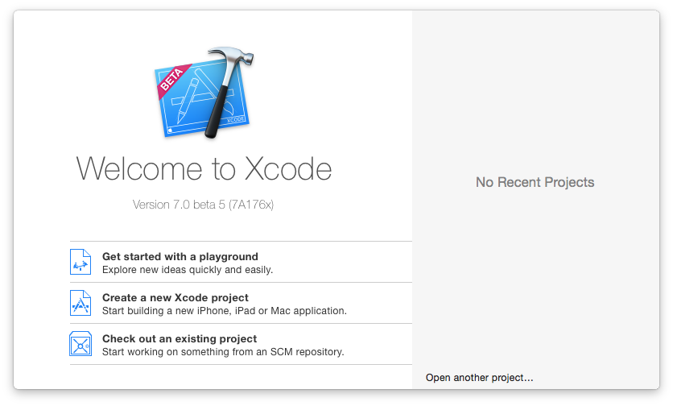
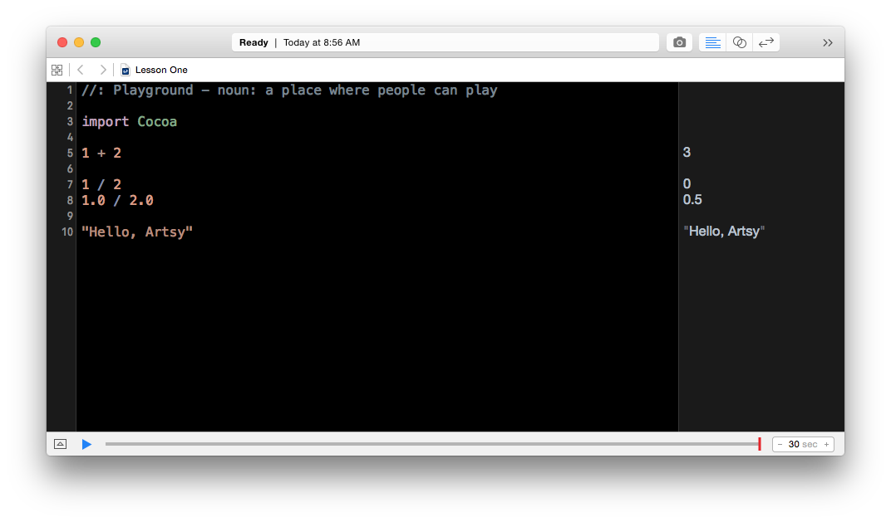

Hey! So we're going to be looking at Swift from the perspective of learning programming. This means you get to ask awkward questions and I struggle to verbalise concepts that are the programming wquivilent of muscle memory. It'll be fun!

To start of we need to get to a point where we can write any code. We're going to assume that you already have a copy of Xcode 7 installed. With that, let's get started!

Open Xcode and you'll get this Welcome dialogue. 



We'll be using _playgrounds_ to learn Swift. Click "Get started with a playground", give it a name, and make sure the platform is set to **OS X**. 


Awesome. Xcode will create an open the playground for you. It'll look something like this. 


The large pane on the left is where we're going to write code. On the right is where the results of our code are displayed. You can see that there's already one line of code written for us, `var str = "Hello, playground"`, and the results pane says `"Hello, playground"`. Neat. 


Normally for things I work with, the code we are writing gets transformed from something we, as humans, kind-of understand to something a machine understands via a compiler. Let's stick with the idea that it's basically a translator from human to machine. Normally its a big upfront conversion, for example Eigen can take 5 minutes to compile. 

We're going to use Playgrounds, which is more like a back and forth conversation with the compiler, so it's much faster to write code and test things out. These are called REPLs.

What this means is whatever you type will be run by Xcode and the results will be shown on the right. When Xcode is compiling code (whenever you change text), the top bar of the window will change to say "Running" and will show a little spinner. 

Let's start by saying what _isn't_ code. You see the the first line, how it is greyed out? Well that's a comment. Comments are annotations in the code that are not ran by the compiler. We'll be using comments occasionally to skip bits of code, or to remind us what something is.

OK let's write some code, let's try typing some things. 

```swift
1 + 2

1 / 2
1.0 / 2.0

"Hello, Artsy"
```

You can see the results in the results pane:



In programming, we want to work with abstractions. So let's make our first variable. We're going to make a simple calculator with a variable. What I'd like to do is define a variable called `a` and `b` then add them together to make `c`. This is a trivial example, but it's about foundations.

```swift
var a = 2
var b = 3

var c = a + b
```

Swift defines variables using `var`. While there is no type specified, the variable `a` is a `Int` (basically a round number; 1, 2, 3). Swift is a **strongly-typed language**, even though most of the time you don't actually need to say what type of thing it is. The compiler figures out the type of variables. 

In Swift, `:` specifies a type. So the following two lines are equivalent.

```swift
var myString = "Hello, Artsy"
var myString: String = "Hello, Artsy"
```

In this case we're dealing with a collection of letters, that combined, we call a string. This is common terminology in most programming languages, think of it as a string of letters.

```swift
var myString: String = 1
```

Swift will complain and say that `'Int' is not convertible to 'String'`. This is Swift's compile-time type checking. It prevents bugs from happening in apps at runtime by giving you errors before-hand. Swift's primary goal is safety against crashes in apps. 

When we're writing code, very often we want to print out some useful information for someone to read. We're going to use this to show that some of our code is running. So lets add a print statment saying what the value of `c` is:

```swift
print(c)
```

With that working, we can use that to start doing some logic. We want to start checking how big our `c` is, and just like in English, we'll use an `if` statement:

```swift
if c > 6 {
    print("Pretty big c you got there.")
}
```

Let's unpack what we're seeing here. `if [something]` - what's happening here is that the bit after the `if` is checking to see if `c` is greater than the number (`Int`) `6`. If it is, then it will run the code inside the braces. 

It is common to use a left margin / indentation to indicate that something is inside a braced section. It's not enforced though.

We've got one more thing to go over, and that is loops. Let's make a nice simple one, again, this reads like English. For _a_ number in _zero to c_. 

```swift
for number in 0...c {
    print("hi")
}
```

It has the same behavior that we saw in the `if` example. It will run the thing inside the braces as many times as the value of `c`. Each time it will print out `"Hi"`. I think we can expand on this one little bit. The word `number` here is actually a variable, let's make it sound all mathematical and call it `x` instead.

```swift
for x in 0...c {
    print("hi")
}
```

Now we know it's a variable, lets print it!

```swift
for x in 0...c {
    print(x)
}
```

If you hit the little triangle in the bottom left you can see the printed output!

----------------

So let's recap.

* We've learned a little bit about variables, they are named values that make it easier for us to think about what something represents vs what it is.

* Then we looked at some `String`s, and showed that you can't change something from a string to a number once you've start using it as a `String`,

* We then printed some information.

* After that we looked at adding an `if` statement to add some logic to our code.

* Finally we wrapped up with a `for in` loop.

If you're keen, feel free to keep playing in the playground, or start looking at the Stanford Swift Course: https://www.youtube.com/playlist?list=PLxwBNxx9j4PW4sY-wwBwQos3G6Kn3x6xP
